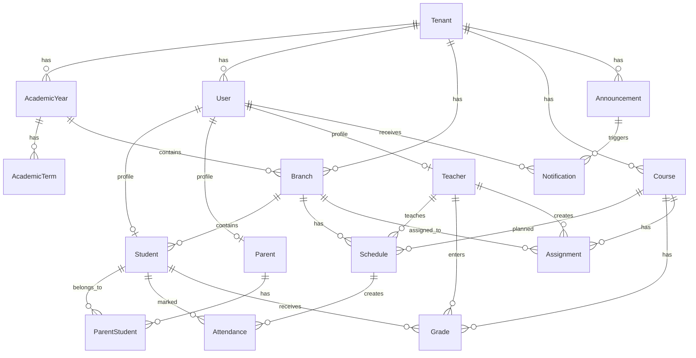

# Oksis V1 Çekirdek Veritabanı Şeması

> **Proje:** Oksis  
> **Kapsam:** V1 çekirdek backend veritabanı şeması  
> **Amaç:** Multi-tenant okul yönetim sistemi için akademik yıl, kullanıcı, şube, ders programı, yoklama, not, ödev, duyuru ve bildirim altyapısını başlangıçta sağlam kurmak.

---

## 1. Genel Yaklaşım

Bu şema Oksis'in ilk canlıya çıkış kapsamı için hazırlanmıştır.

Temel hedefler:

- Multi-tenant yapı ile her okulun verisini izole etmek
- Akademik yıl ve dönem bazlı veri yönetimi kurmak
- Öğrenci, veli, öğretmen ve yönetici kullanıcılarını merkezi yönetmek
- Çok çocuklu veli desteğini en baştan desteklemek
- Yoklama, not, ödev, duyuru ve bildirim akışlarını tek çekirdekte toplamak
- Gelecekte mesajlaşma, raporlama, AI ve çoklu kampüs gibi modüllere genişleyebilir yapı bırakmak

---

## 2. Ana İlişki Şeması



---

## 3. Ortak Kolon Standardı

Aşağıdaki kolonlar mümkün olan tüm tablolarda standart olarak kullanılmalıdır.

| Field | Type | Açıklama |
|---|---:|---|
| `Id` | uniqueidentifier | Primary key. UUID önerilir. |
| `TenantId` | uniqueidentifier | Verinin hangi okula ait olduğunu belirtir. Multi-tenant izolasyon için zorunludur. |
| `IsActive` | bit | Kayıt aktif mi? |
| `IsDeleted` | bit | Soft delete için kullanılır. |
| `CreatedAt` | datetime2 | Oluşturulma tarihi. |
| `CreatedByUserId` | uniqueidentifier | Kaydı oluşturan kullanıcı. |
| `UpdatedAt` | datetime2 | Son güncellenme tarihi. |
| `UpdatedByUserId` | uniqueidentifier | Son güncelleyen kullanıcı. |
| `DeletedAt` | datetime2 | Silinme tarihi. |
| `DeletedByUserId` | uniqueidentifier | Silen kullanıcı. |

> Not: `TenantId`, `Tenants` tablosunun kendisinde bulunmaz.

---

# 4. Tablolar

## 4.1 `Tenants`

Okul / kurum kaydıdır. Sistemdeki her okul bir tenant olur.

| Field | Type | Zorunlu | Açıklama |
|---|---:|:---:|---|
| `Id` | uniqueidentifier | Evet | Tenant ID. |
| `Name` | nvarchar(200) | Evet | Okul adı. |
| `Code` | nvarchar(50) | Evet | Kısa okul kodu. |
| `Subdomain` | nvarchar(100) | Hayır | Örn: `abcokulu.oksis.net`. |
| `LogoUrl` | nvarchar(500) | Hayır | Okul logosu. |
| `PrimaryColor` | nvarchar(20) | Hayır | Okula özel tema rengi. |
| `Status` | int | Evet | `Active`, `Passive`, `Suspended`. |
| `PlanType` | int | Evet | Paket tipi. Başlangıç / büyüme / kurumsal. |

---

## 4.2 `AcademicYears`

Eğitim yılı ana çatısıdır. Örn: `2025-2026`.

| Field | Type | Zorunlu | Açıklama |
|---|---:|:---:|---|
| `Id` | uniqueidentifier | Evet | Eğitim yılı ID. |
| `TenantId` | uniqueidentifier | Evet | Okul ID. |
| `Name` | nvarchar(50) | Evet | Eğitim yılı adı. Örn: `2025-2026`. |
| `StartDate` | date | Evet | Eğitim yılı başlangıcı. |
| `EndDate` | date | Evet | Eğitim yılı bitişi. |
| `Status` | int | Evet | `Draft`, `Active`, `Archived`. |
| `IsCurrent` | bit | Evet | Aktif kullanılan yıl mı? |

### Kritik Kurallar

- Aynı tenant içinde yalnızca bir aktif eğitim yılı olmalıdır.
- Arşivlenmiş eğitim yılı salt okunur olmalıdır.
- Yeni eğitim yılı yayınlama işlemi atomik olmalıdır.

---

## 4.3 `AcademicTerms`

Dönem bilgisidir. 1. dönem / 2. dönem gibi.

| Field | Type | Zorunlu | Açıklama |
|---|---:|:---:|---|
| `Id` | uniqueidentifier | Evet | Dönem ID. |
| `TenantId` | uniqueidentifier | Evet | Okul ID. |
| `AcademicYearId` | uniqueidentifier | Evet | Bağlı eğitim yılı. |
| `Name` | nvarchar(100) | Evet | `1. Dönem`, `2. Dönem`. |
| `TermType` | int | Evet | `FirstTerm`, `SecondTerm`, `FullYear`. |
| `StartDate` | date | Evet | Dönem başlangıcı. |
| `EndDate` | date | Evet | Dönem bitişi. |
| `Status` | int | Evet | `Draft`, `Active`, `Closed`. |
| `IsCurrent` | bit | Evet | Aktif dönem mi? |

---

## 4.4 `Users`

Tüm giriş yapabilen kullanıcıların ana tablosudur.

| Field | Type | Zorunlu | Açıklama |
|---|---:|:---:|---|
| `Id` | uniqueidentifier | Evet | Kullanıcı ID. |
| `TenantId` | uniqueidentifier | Evet | Okul ID. |
| `FirstName` | nvarchar(100) | Evet | Ad. |
| `LastName` | nvarchar(100) | Evet | Soyad. |
| `Email` | nvarchar(200) | Hayır | E-posta. Davet ve giriş için kullanılır. |
| `PhoneNumber` | nvarchar(30) | Hayır | Telefon. |
| `PasswordHash` | nvarchar(max) | Hayır | Şifre hash değeri. Magic link veya davet akışında başlangıçta boş olabilir. |
| `UserType` | int | Evet | `Admin`, `Teacher`, `Parent`, `Student`. |
| `Status` | int | Evet | `Active`, `Passive`, `Invited`, `Locked`. |
| `LastLoginAt` | datetime2 | Hayır | Son giriş zamanı. |
| `EmailConfirmedAt` | datetime2 | Hayır | E-posta doğrulama zamanı. |

### Kritik Kurallar

- Kullanıcı giriş altyapısı tek merkezden yönetilmelidir.
- Öğrenci, veli ve öğretmen detayları ayrı profil tablolarında tutulmalıdır.
- Aynı tenant içinde e-posta benzersiz olmalıdır.

---

## 4.5 `Students`

Öğrenci profil tablosudur.

| Field | Type | Zorunlu | Açıklama |
|---|---:|:---:|---|
| `Id` | uniqueidentifier | Evet | Öğrenci ID. |
| `TenantId` | uniqueidentifier | Evet | Okul ID. |
| `UserId` | uniqueidentifier | Evet | Kullanıcı hesabı. |
| `StudentNumber` | nvarchar(50) | Evet | Okul öğrenci numarası. |
| `BranchId` | uniqueidentifier | Evet | Aktif şube. |
| `AcademicYearId` | uniqueidentifier | Evet | Aktif eğitim yılı. |
| `GradeLevel` | int | Evet | Sınıf seviyesi. Örn: 9. |
| `EnrollmentDate` | date | Hayır | Kayıt tarihi. |
| `Status` | int | Evet | `Active`, `Graduated`, `Transferred`, `Passive`. |

---

## 4.6 `Parents`

Veli profil tablosudur.

| Field | Type | Zorunlu | Açıklama |
|---|---:|:---:|---|
| `Id` | uniqueidentifier | Evet | Veli ID. |
| `TenantId` | uniqueidentifier | Evet | Okul ID. |
| `UserId` | uniqueidentifier | Evet | Kullanıcı hesabı. |
| `RelationType` | int | Hayır | `Mother`, `Father`, `Guardian`, `Other`. |
| `Occupation` | nvarchar(100) | Hayır | Meslek. |
| `CanReceiveNotification` | bit | Evet | Bildirim alabilir mi? |

---

## 4.7 `ParentStudents`

Veli-öğrenci çoklu ilişki tablosudur.

| Field | Type | Zorunlu | Açıklama |
|---|---:|:---:|---|
| `Id` | uniqueidentifier | Evet | Kayıt ID. |
| `TenantId` | uniqueidentifier | Evet | Okul ID. |
| `ParentId` | uniqueidentifier | Evet | Veli ID. |
| `StudentId` | uniqueidentifier | Evet | Öğrenci ID. |
| `IsPrimaryContact` | bit | Evet | Birincil veli mi? |
| `CanViewGrades` | bit | Evet | Notları görebilir mi? |
| `CanViewAttendance` | bit | Evet | Devamsızlığı görebilir mi? |
| `CanReceivePush` | bit | Evet | Push alabilir mi? |

### Kritik Kurallar

- Bir veli birden fazla öğrenciye bağlı olabilir.
- Bir öğrenci birden fazla veliye bağlı olabilir.
- Her çocuk için ayrı bildirim yetkisi yönetilmelidir.

---

## 4.8 `Teachers`

Öğretmen profil tablosudur.

| Field | Type | Zorunlu | Açıklama |
|---|---:|:---:|---|
| `Id` | uniqueidentifier | Evet | Öğretmen ID. |
| `TenantId` | uniqueidentifier | Evet | Okul ID. |
| `UserId` | uniqueidentifier | Evet | Kullanıcı hesabı. |
| `EmployeeNumber` | nvarchar(50) | Hayır | Personel numarası. |
| `Title` | nvarchar(100) | Hayır | Ünvan. |
| `Specialty` | nvarchar(100) | Hayır | Branş. |
| `Status` | int | Evet | `Active`, `Passive`, `Left`. |

---

## 4.9 `Branches`

Şube / sınıf grubudur. Örn: `9-A`.

| Field | Type | Zorunlu | Açıklama |
|---|---:|:---:|---|
| `Id` | uniqueidentifier | Evet | Şube ID. |
| `TenantId` | uniqueidentifier | Evet | Okul ID. |
| `AcademicYearId` | uniqueidentifier | Evet | Eğitim yılı. |
| `AcademicTermId` | uniqueidentifier | Hayır | Dönem. Tam yıl şubelerinde boş bırakılabilir. |
| `Name` | nvarchar(50) | Evet | Şube adı. Örn: `A`. |
| `GradeLevel` | int | Evet | Sınıf seviyesi. |
| `FullName` | nvarchar(100) | Evet | Örn: `9-A`. |
| `AdvisorTeacherId` | uniqueidentifier | Hayır | Rehber öğretmen. |
| `Status` | int | Evet | `Draft`, `Active`, `Archived`. |

### Kritik Kurallar

- Öğrenci aynı dönem içinde yalnızca bir aktif şubede bulunmalıdır.
- Arşivlenmiş şubeler salt okunur olmalıdır.
- Şube değişiminde geçmiş kayıtlar korunmalıdır.

---

## 4.10 `Courses`

Ders tanımıdır. Matematik, Türkçe, Fizik gibi.

| Field | Type | Zorunlu | Açıklama |
|---|---:|:---:|---|
| `Id` | uniqueidentifier | Evet | Ders ID. |
| `TenantId` | uniqueidentifier | Evet | Okul ID. |
| `Name` | nvarchar(150) | Evet | Ders adı. |
| `Code` | nvarchar(50) | Hayır | Ders kodu. |
| `GradeLevel` | int | Evet | Hangi sınıf seviyesinde okutulur. |
| `WeeklyHour` | int | Hayır | Haftalık ders saati. |
| `Status` | int | Evet | `Active`, `Passive`. |

---

## 4.11 `Schedules`

Ders programı tablosudur.

| Field | Type | Zorunlu | Açıklama |
|---|---:|:---:|---|
| `Id` | uniqueidentifier | Evet | Program ID. |
| `TenantId` | uniqueidentifier | Evet | Okul ID. |
| `AcademicYearId` | uniqueidentifier | Evet | Eğitim yılı. |
| `AcademicTermId` | uniqueidentifier | Evet | Dönem. |
| `BranchId` | uniqueidentifier | Evet | Şube. |
| `CourseId` | uniqueidentifier | Evet | Ders. |
| `TeacherId` | uniqueidentifier | Evet | Öğretmen. |
| `DayOfWeek` | int | Evet | Haftanın günü. |
| `StartTime` | time | Evet | Ders başlangıç saati. |
| `EndTime` | time | Evet | Ders bitiş saati. |
| `LessonOrder` | int | Evet | Kaçıncı ders. |
| `ClassroomName` | nvarchar(100) | Hayır | Sınıf / oda bilgisi. |

### Kritik Kurallar

- Aynı öğretmene aynı saat aralığında ikinci ders atanamaz.
- Aynı şubeye aynı saat aralığında ikinci ders atanamaz.
- Tatil günlerine ders atanamaz.

---

## 4.12 `Attendances`

Yoklama kayıtlarıdır.

| Field | Type | Zorunlu | Açıklama |
|---|---:|:---:|---|
| `Id` | uniqueidentifier | Evet | Yoklama ID. |
| `TenantId` | uniqueidentifier | Evet | Okul ID. |
| `AcademicYearId` | uniqueidentifier | Evet | Eğitim yılı. |
| `AcademicTermId` | uniqueidentifier | Evet | Dönem. |
| `ScheduleId` | uniqueidentifier | Evet | Hangi ders programı satırı. |
| `BranchId` | uniqueidentifier | Evet | Şube. |
| `CourseId` | uniqueidentifier | Evet | Ders. |
| `TeacherId` | uniqueidentifier | Evet | Yoklamayı alan öğretmen. |
| `StudentId` | uniqueidentifier | Evet | Öğrenci. |
| `AttendanceDate` | date | Evet | Yoklama tarihi. |
| `Status` | int | Evet | `Present`, `Absent`, `Late`, `Excused`. |
| `Note` | nvarchar(500) | Hayır | Açıklama. |
| `SubmittedAt` | datetime2 | Evet | Kaydetme zamanı. |

### Kritik Kurallar

- Aynı öğrenci için aynı ders ve tarih kombinasyonunda tek aktif yoklama kaydı olmalıdır.
- Yoklama kaydedildiğinde veliye bildirim tetiklenmelidir.
- Devamsızlık eşiği kontrolü bu akıştan sonra çalışmalıdır.

---

## 4.13 `Grades`

Not kayıtlarıdır.

| Field | Type | Zorunlu | Açıklama |
|---|---:|:---:|---|
| `Id` | uniqueidentifier | Evet | Not ID. |
| `TenantId` | uniqueidentifier | Evet | Okul ID. |
| `AcademicYearId` | uniqueidentifier | Evet | Eğitim yılı. |
| `AcademicTermId` | uniqueidentifier | Evet | Dönem. |
| `StudentId` | uniqueidentifier | Evet | Öğrenci. |
| `CourseId` | uniqueidentifier | Evet | Ders. |
| `TeacherId` | uniqueidentifier | Evet | Notu giren öğretmen. |
| `GradeType` | int | Evet | `Exam`, `Quiz`, `Performance`, `Project`. |
| `Title` | nvarchar(150) | Evet | Örn: `1. Yazılı`. |
| `Score` | decimal(5,2) | Evet | Not değeri. |
| `MaxScore` | decimal(5,2) | Evet | Maksimum puan. |
| `Status` | int | Evet | `Draft`, `Published`. |
| `PublishedAt` | datetime2 | Hayır | Yayınlanma zamanı. |

### Kritik Kurallar

- Notlar `Published` olmadan veli ve öğrenciye görünmemelidir.
- Taslak → yayın geçişi atomik olmalıdır.
- Yayınlanan not için bildirim tetiklenmelidir.

---

## 4.14 `Assignments`

Ödev kayıtlarıdır.

| Field | Type | Zorunlu | Açıklama |
|---|---:|:---:|---|
| `Id` | uniqueidentifier | Evet | Ödev ID. |
| `TenantId` | uniqueidentifier | Evet | Okul ID. |
| `AcademicYearId` | uniqueidentifier | Evet | Eğitim yılı. |
| `AcademicTermId` | uniqueidentifier | Evet | Dönem. |
| `BranchId` | uniqueidentifier | Evet | Hedef şube. |
| `CourseId` | uniqueidentifier | Evet | Ders. |
| `TeacherId` | uniqueidentifier | Evet | Ödevi oluşturan öğretmen. |
| `Title` | nvarchar(200) | Evet | Ödev başlığı. |
| `Description` | nvarchar(max) | Hayır | Ödev açıklaması. |
| `DueDate` | datetime2 | Evet | Son teslim tarihi. |
| `Status` | int | Evet | `Draft`, `Published`, `Cancelled`. |
| `PublishedAt` | datetime2 | Hayır | Yayın tarihi. |

### Kritik Kurallar

- Ödev yayınlanmadan öğrenci ve veliye görünmemelidir.
- Yayınlanan ödev için bildirim tetiklenmelidir.
- Son teslim tarihine göre zamanlı bildirim planlanmalıdır.

---

## 4.15 `Announcements`

Duyuru kayıtlarıdır.

| Field | Type | Zorunlu | Açıklama |
|---|---:|:---:|---|
| `Id` | uniqueidentifier | Evet | Duyuru ID. |
| `TenantId` | uniqueidentifier | Evet | Okul ID. |
| `Title` | nvarchar(200) | Evet | Duyuru başlığı. |
| `Content` | nvarchar(max) | Evet | Duyuru içeriği. |
| `TargetType` | int | Evet | `AllSchool`, `Teachers`, `Parents`, `Students`, `Branch`. |
| `BranchId` | uniqueidentifier | Hayır | Şube hedefliyse kullanılır. |
| `CreatedByUserId` | uniqueidentifier | Evet | Duyuruyu oluşturan kullanıcı. |
| `Status` | int | Evet | `Draft`, `Published`, `Archived`. |
| `PublishedAt` | datetime2 | Hayır | Yayınlanma tarihi. |

### Kritik Kurallar

- Duyuru hedef kitlesi net olmalıdır.
- Yayınlanan duyuru için ilgili kullanıcılara bildirim oluşturulmalıdır.
- Taslak duyurular hedef kitleye görünmemelidir.

---

## 4.16 `Notifications`

Push / sistem içi bildirim kayıtlarıdır.

| Field | Type | Zorunlu | Açıklama |
|---|---:|:---:|---|
| `Id` | uniqueidentifier | Evet | Bildirim ID. |
| `TenantId` | uniqueidentifier | Evet | Okul ID. |
| `UserId` | uniqueidentifier | Evet | Bildirimi alacak kullanıcı. |
| `NotificationType` | int | Evet | `Attendance`, `Grade`, `Assignment`, `Announcement`, `System`. |
| `Title` | nvarchar(200) | Evet | Bildirim başlığı. |
| `Message` | nvarchar(500) | Evet | Bildirim metni. |
| `ReferenceType` | nvarchar(100) | Hayır | İlgili kaynak tipi. Örn: `Grade`. |
| `ReferenceId` | uniqueidentifier | Hayır | İlgili kayıt ID. |
| `Channel` | int | Evet | `Push`, `Email`, `Sms`, `InApp`. |
| `Status` | int | Evet | `Pending`, `Sent`, `Failed`, `Read`. |
| `SentAt` | datetime2 | Hayır | Gönderim zamanı. |
| `ReadAt` | datetime2 | Hayır | Okunma zamanı. |

---

# 5. Kritik İlişki Yapıları

## 5.1 Kullanıcı Profil Ayrımı

```text
Users
 ├── Students
 ├── Parents
 └── Teachers
```

Açıklama:

- `Users` login ve kimlik bilgisini taşır.
- `Students`, `Parents`, `Teachers` rol bazlı profil bilgisini taşır.
- Böylece login altyapısı tek olur, domain detayları ayrışır.

---

## 5.2 Veli - Öğrenci İlişkisi

```text
Parents
 └── ParentStudents
       └── Students
```

Açıklama:

- Bir veli birden fazla öğrenciyi görebilir.
- Bir öğrencinin birden fazla velisi olabilir.
- Görme ve bildirim izinleri öğrenci-veli ilişkisi bazında yönetilir.

---

## 5.3 Akademik Yapı

```text
Tenants
 └── AcademicYears
       └── AcademicTerms
             └── Branches
```

Açıklama:

- Her okulun kendi eğitim yılı vardır.
- Her eğitim yılı dönemlere ayrılır.
- Şubeler eğitim yılı ve dönem bağlamında yönetilir.
- Arşiv ve geçmiş yıl görüntüleme bu yapı üzerinden yapılır.

---

## 5.4 Günlük Akademik Akış

```text
Schedules
 ├── Attendances
 ├── Grades
 └── Assignments
```

Açıklama:

- Ders programı günlük akademik operasyonun merkezidir.
- Yoklama, not ve ödevler ders/şube/öğretmen bağlamında çalışır.
- Öğretmen ekranları bu yapı üzerinden sadeleştirilir.

---

# 6. Önerilen Enum Değerleri

## 6.1 `UserType`

| Value | Name | Açıklama |
|---:|---|---|
| 1 | `Admin` | Yönetim kullanıcısı. |
| 2 | `Teacher` | Öğretmen. |
| 3 | `Parent` | Veli. |
| 4 | `Student` | Öğrenci. |

## 6.2 `RecordStatus`

| Value | Name | Açıklama |
|---:|---|---|
| 1 | `Draft` | Taslak. |
| 2 | `Active` | Aktif. |
| 3 | `Passive` | Pasif. |
| 4 | `Archived` | Arşiv. |
| 5 | `Deleted` | Silinmiş. |

## 6.3 `AttendanceStatus`

| Value | Name | Açıklama |
|---:|---|---|
| 1 | `Present` | Derste var. |
| 2 | `Absent` | Yok. |
| 3 | `Late` | Geç geldi. |
| 4 | `Excused` | Mazeretli. |

## 6.4 `GradeStatus`

| Value | Name | Açıklama |
|---:|---|---|
| 1 | `Draft` | Sadece öğretmen görür. |
| 2 | `Published` | Veli ve öğrenci görür. |

## 6.5 `NotificationStatus`

| Value | Name | Açıklama |
|---:|---|---|
| 1 | `Pending` | Gönderilmeyi bekliyor. |
| 2 | `Sent` | Gönderildi. |
| 3 | `Failed` | Gönderilemedi. |
| 4 | `Read` | Okundu. |

---

# 7. İlk Migration İçin Önerilen Tablo Listesi

İlk migration'da aşağıdaki tablolar oluşturulmalıdır:

```text
Tenants
AcademicYears
AcademicTerms
Users
Students
Parents
ParentStudents
Teachers
Branches
Courses
Schedules
Attendances
Grades
Assignments
Announcements
Notifications
```

---

# 8. Backend Geliştirme Notları

## 8.1 Multi-Tenant Güvenlik

Her sorguda `TenantId` filtresi zorunlu olmalıdır.

Örnek:

```csharp
query = query.Where(x => x.TenantId == currentTenantId);
```

Tenant filtresi unutulursa bir okulun başka okul verisini görme riski oluşur.

---

## 8.2 Soft Delete

Silme işlemleri fiziksel delete yerine soft delete olmalıdır.

```text
IsDeleted = true
DeletedAt = DateTime.UtcNow
DeletedByUserId = currentUserId
```

---

## 8.3 Audit Alanları

Her create/update/delete işleminde audit kolonları otomatik doldurulmalıdır.

```text
CreatedAt
CreatedByUserId
UpdatedAt
UpdatedByUserId
DeletedAt
DeletedByUserId
```

---

## 8.4 Yayınlama İşlemleri

Aşağıdaki işlemler transaction içinde yapılmalıdır:

- Not yayınlama
- Ödev yayınlama
- Duyuru yayınlama
- Yeni eğitim yılı yayınlama
- Dönem geçişi

---

## 8.5 Bildirim Tetikleme

Aşağıdaki olaylardan sonra notification kaydı oluşturulmalıdır:

| Olay | Bildirim Alıcıları |
|---|---|
| Yoklama kaydedildi | İlgili veli |
| Not yayınlandı | İlgili veli ve öğrenci |
| Ödev yayınlandı | İlgili veli ve öğrenci |
| Duyuru yayınlandı | Hedef kitle |
| Devamsızlık eşiği aşıldı | Yönetim, veli, ilgili öğretmen |

---

# 9. Sonuç

Bu V1 şema; Oksis'in ilk canlıya çıkış hedefi için gerekli temel domain yapısını sağlar.

Özellikle şu kararlar baştan doğru konumlandırılmıştır:

- Multi-tenant mimari
- Eğitim yılı / dönem / şube omurgası
- Tek kullanıcı tablosu + rol bazlı profil tabloları
- Çok çocuklu veli desteği
- Ders programı merkezli akademik akış
- Taslak → yayınlama mantığı
- Bildirim altyapısı
- Soft delete ve audit standardı

Bu şema nihai değildir; ancak Oksis'in büyümesini taşıyabilecek sağlam bir başlangıç noktasıdır.
