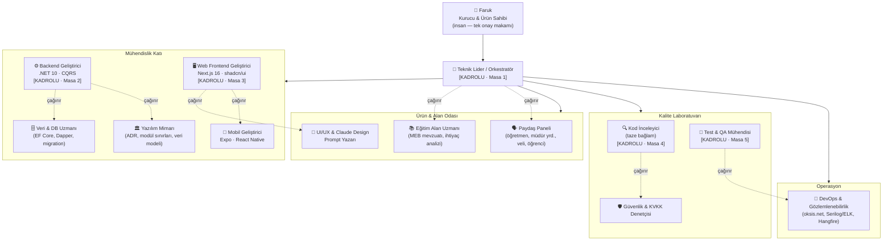
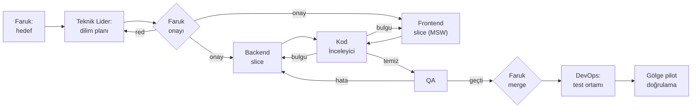

# OKSİS Sanal Ofis — Organizasyon Şeması

> **Ofis:** Pixel Agents (VS Code) · **Motor:** Claude Code subagent'ları
> **Sahip:** Faruk — Kurucu & Ürün Sahibi
> **Sürüm:** v1.1 · Ekim 2026 — v1.1: yığın gerçek repolara göre düzeltildi (Next.js/Expo), kurulum yapıldı (§7)

---

## 0. Önce bir gerçeklik ayarı

Pixel Agents bir **gözlem katmanıdır**: her Claude Code terminali ofiste bir karaktere dönüşür, ajanın ne yaptığını (yazıyor / okuyor / onay bekliyor) canlandırır. Ajanları **o yaratmaz, yönetmez**. Yani bu şemadaki her "çalışan" aslında:

1. `~/.claude/agents/oksis-<rol>.md` dosyasında tanımlı bir **subagent**, ya da
2. Kendi terminalinde (ve kendi git worktree'sinde) çalışan **ayrı bir Claude Code oturumu**dur.

Pixel Agents'ta ofis düzeni (masa, oda, dekor) sadece görseldir; **organizasyonu bu dosya ve agent tanımları taşır.**

İkinci ayar: Tek kurucu olarak aynı anda 12 terminali yönetemezsin — darboğaz ajan değil, **senin onay kapasiten**. Bu yüzden ofis iki katmanlı kuruldu:

| Katman | Ne demek | Pixel Agents'ta |
|---|---|---|
| **Kadrolu masa** (5) | Her gün açık terminal, kendi worktree'si | Kalıcı karakter + masa |
| **Çağrılan uzman** (8) | Kadrolu ajanların subagent olarak çağırdığı roller | Ana karakterin altında kısa süreli görünür |

---

## 1. Organizasyon şeması



---

## 2. Pixel Agents ofis yerleşimi

```
┌──────────────────────────────────────────────────────────────────┐
│  YÖNETİM ODASI                 │  ÜRÜN & ALAN ODASI              │
│  [Masa 1] Teknik Lider         │  (toplantı masası — çağrılan    │
│  + beyaz tahta: SESSION-       │   uzmanlar burada belirir)      │
│    HANDOFF.md                  │   Eğitim Uzmanı · Paydaş Paneli │
│                                │   Tasarım Prompt Yazarı         │
├────────────────────────────────┴─────────────────────────────────┤
│  MÜHENDİSLİK KATI                                                │
│  [Masa 2] Backend (.NET)        [Masa 3] Web Frontend            │
│   └ yan masa: DB Uzmanı          └ yan masa: Mobil (Expo RN)     │
│   └ yan masa: Mimar                                              │
├──────────────────────────────────────────────────────────────────┤
│  KALİTE LABORATUVARI           │  OPERASYON                      │
│  [Masa 4] Kod İnceleyici       │  (sunucu rafı dekoru)           │
│   └ yan masa: Güvenlik & KVKK  │  DevOps — dağıtım günü açılır   │
│  [Masa 5] Test & QA            │                                 │
└──────────────────────────────────────────────────────────────────┘
```

Karakter durumları bir bakışta yönetim paneli işi görür: **"onay bekliyor"** balonu çıkan karakter = senin masana iş düştü.

---

## 3. Rol kartları

### 🎯 Masa 1 — Teknik Lider / Orkestratör `KADROLU`
- **Misyon:** İşi dilimlere böler, doğru ajana atar, plan-önce kuralını uygular.
- **Girdi:** Faruk'tan gelen hedef, ihtiyaç/teknik analiz dokümanları, açık karar listeleri (KK-xx, K-xx, BR-xx).
- **Çıktı:** Dilim planı, görev kırılımı, `SESSION-HANDOFF.md` güncellemesi.
- **Kurallar:**
  - Plan sunar, **Faruk onaylamadan uygulama başlatmaz.**
  - Sprint-önce kuralı: tüm modüller aynı olgunlukta ilerler; bir modülü tüm sprintlerde bitirip ötekine geçmez.
  - Kilitlenmemiş karar varsa (ör. Kulüp KK-01–08) o dilimi başlatmaz, kararı Faruk'a getirir.
- **Yapmaz:** Kod yazmaz, merge etmez.
- **Model:** `opus`

### ⚙️ Masa 2 — Backend Geliştirici `KADROLU`
- **Misyon:** `oksis-api` içinde dikey dilim (feature slice) geliştirme.
- **Standartlar:** .NET 10 · Clean Architecture · CQRS/MediatR · Vertical Slice · Modular Monolith · FluentValidation · Mapster (AutoMapper yasak) · Scalar (Swagger yasak) · Serilog yapılandırılmış log (Console.WriteLine yasak) · tüm handler'larda `CancellationToken` · RFC 9457 ProblemDetails + `errorCode`.
- **Çağırdığı uzmanlar:** Veri & DB Uzmanı, Yazılım Mimarı.
- **Yapmaz:** Modüller arası doğrudan bağımlılık kurmaz (cross-module erişim yalnızca abstraction ile, ör. `IAbsenceDaysBatchReader`).
- **Model:** `sonnet` · **Worktree:** `~/Repositories/oksis-api-wt-backend`

### 🖥️ Masa 3 — Web Frontend Geliştirici `KADROLU`
- **Misyon:** `oksis-ui` monorepo'sunda `apps/web` ekranları; API sözleşmesine (`packages/api/src/generated/schema.ts`) bağlı, MSW mock ile paralel geliştirme.
- **Standartlar:** npm workspaces + Turborepo · Next.js 16 (App Router) · TypeScript strict · shadcn/ui (Radix, Mira) · Tailwind v4 · TanStack Query · Zod · MSW · `openapi-typescript`. Katmanlar `apps/* → packages/api → packages/core`. İngilizce identifier (MEB sözlüğü), Türkçe UI metni. Marka token'ları (Plus Jakarta Sans, navy #1B2B5E, accent #4F6BFF) — ham hex değil semantik token. Bağlayıcı kaynak: `oksis-ui/CLAUDE.md`.
- **Çağırdığı uzmanlar:** UI/UX Prompt Yazarı, Mobil Geliştirici.
- **Yapmaz:** Backend sözleşmesini tek taraflı değiştirmez; sözleşme değişikliği Teknik Lider'e gider.
- **Model:** `sonnet` · **Worktree:** `~/Repositories/oksis-ui-wt-web`

### 🔍 Masa 4 — Kod İnceleyici `KADROLU`
- **Misyon:** Her PR'ı **kodu yazan ajanın bağlamını görmeden** inceler (kendi notunu kendine vermeme ilkesi).
- **Eksenler:** Doğruluk · okunabilirlik · mimari uyum · güvenlik · performans.
- **Kontrol listesi:** Katman ihlali var mı? Domain → Infrastructure bağımlılığı? God service? Statik helper istismarı? Tenant izolasyonu (her sorguda `SchoolId` filtresi)?
- **Çağırdığı uzman:** Güvenlik & KVKK Denetçisi.
- **Yapmaz:** Kendisi düzeltme yazmaz; bulgu raporlar.
- **Model:** `opus` · **İzin:** salt okuma (Bash yalnız `git diff/log/show`) · **Klasör:** ana `oksis-ui` + `oksis-api` kopyaları

### 🧪 Masa 5 — Test & QA Mühendisi `KADROLU`
- **Misyon:** İş kurallarını (BR-xx) teste çevirir; birim + entegrasyon + uçtan uca.
- **Yöntem:** Hata raporlarında önce hatayı kanıtlayan başarısız test, sonra düzeltme.
- **Gölge pilot bağlantısı:** Gölge pilot okulda gözlenen boşlukları test senaryosuna dönüştürür.
- **Çağırdığı uzman:** DevOps.
- **Model:** `sonnet` · **Worktree:** `~/Repositories/oksis-ui-wt-qa`

---

### Çağrılan uzmanlar (subagent)

| Rol | Ne zaman çağrılır | Çıktı | Model |
|---|---|---|---|
| 📚 **Eğitim Alan Uzmanı** | Yeni modül / mevzuat sorusu | Eğitimci perspektifli ihtiyaç analizi (OKSiS v1.0 docx), MEB terminoloji kontrolü | `opus` |
| 🗣️ **Paydaş Paneli** | Karar kilitlenmeden önce | Öğretmen, müdür yardımcısı, veli, öğrenci persona tepkileri | `sonnet` |
| 🎨 **UI/UX Prompt Yazarı** | Ekran envanteri netleşince | Claude Design prompt'ları (ortak bağlam bloğu + ekrana özel + kontrol listesi; Altınay Lisesi örnek veri evreni) | `sonnet` |
| 🏛️ **Yazılım Mimarı** | Veri modeli / modül sınırı / geri alınması pahalı karar | ADR, aggregate tasarımı, DDL taslağı | `opus` |
| 🗄️ **Veri & DB Uzmanı** | Migration, karmaşık sorgu | EF Core migration, Dapper sorgusu, indeks önerisi | `sonnet` |
| 📱 **Mobil Geliştirici** | Mobil ekran dilimi | `oksis-ui/apps/mobile` Expo/React Native ekranları | `sonnet` |
| 🛡️ **Güvenlik & KVKK** | Kişisel veri, auth, dosya yükleme içeren her PR | Bulgu listesi; tenant izolasyonu, JWT/refresh rotation, veri minimizasyonu | `opus` |
| 🚀 **DevOps** | Dağıtım, log/izleme | oksis.net test/prod ortamları, Serilog → Elasticsearch/Kibana, Hangfire, correlation ID | `sonnet` |

---

## 4. Bir dilimin ofisteki yolculuğu



**Kural:** Backend ve Frontend aynı dilimde birlikte ilerler (önce tüm BE, sonra tüm FE değil).

---

## 5. Yetki ve onay matrisi (RACI)

| Karar / İş | Faruk | Teknik Lider | Mimar | BE/FE | İnceleyici | QA |
|---|---|---|---|---|---|---|
| Kapsam ve öncelik | **A** | R | C | I | – | I |
| Veri modeli / ADR | **A** | C | R | C | C | I |
| Dilim planı | **A** | R | C | C | – | C |
| Kod yazımı | I | C | C | **R** | – | – |
| PR onayı (teknik) | I | I | C | – | **R** | – |
| Test sonucu | I | I | – | C | – | **R** |
| Merge ve dağıtım | **A/R** | C | – | – | C | C |

R = yapar · A = son söz · C = danışılır · I = bilgilendirilir

**Değişmez kurallar:**
1. Merge, dağıtım ve geri alınması pahalı kararlar **yalnızca Faruk'ta.**
2. Hiçbir ajan MEB/MEBBİS kimlik bilgisi istemez, işlemez.
3. Yapay zekâ özellikleri pilot kapsamı dışındadır; ajanlar ürüne AI özelliği önermez.
4. e-Okul entegrasyonu yol haritasında yok; yalnızca dışa aktarım dokümanı.

---

## 6. Ortak hafıza ve devir-teslim

| Dosya | Sahibi | Amaç |
|---|---|---|
| `CLAUDE.md` (kök + api + web + mobile) | Teknik Lider | Değişmez standartlar — her ajan okur |
| `docs/SESSION-HANDOFF.md` | Teknik Lider | Ajanlar arası beyaz tahta: aktif dilim, kim neyde, açık engeller |
| `docs/domain/kararlar/` · `docs/bulgular/kararlar/` | Mimar · Teknik Lider | ADR/model kararları · süreç kararları (KK/K/BR/İ kodlarıyla) |
| `docs/ihtiyac-analizleri/<modül>/` · `docs/teknik-analizler/<modül>/` | Eğitim Uzmanı · Mimar | İhtiyaç + teknik analiz |
| Obsidian domain haritası | Teknik Lider | Modül ilişkilerinin grafik görünümü |

Her ajan işe **CLAUDE.md + SESSION-HANDOFF.md okuyarak** başlar, **SESSION-HANDOFF.md'ye satır ekleyerek** biter.

---

## 7. Kurulum (2026-10-07'de yapıldı)

| Parça | Nerede | Not |
|---|---|---|
| Ajan tanımları (13) | `~/.claude/agents/oksis-*.md` | Kullanıcı düzeyi: her iki kod deposunda ve docs'ta görünür. Kadrolu: `oksis-tech-lead`, `oksis-backend-developer`, `oksis-web-developer`, `oksis-code-reviewer`, `oksis-qa-engineer`; geri kalan 8'i çağrılan uzman |
| Worktree'ler | `~/Repositories/oksis-api-wt-backend`, `oksis-ui-wt-web`, `oksis-ui-wt-qa` | `dev`'den açıldı (detached). **Masa sabit, dal değişir:** her işte klasör içinde `git switch -c feature/<ad> dev`. Yerel `.env` / `settings.local.json` ana kopyadan alındı |
| VS Code workspace | `~/Repositories/oksis-ofis.code-workspace` | 7 klasör (Masa 1–5 + Toplantı Odası). Pixel Agents Areas **yalnız multi-root workspace'te** çalışır; eşleme klasör adıyla yapılır |
| Ofis düzeni | `~/.pixel-agents/layout.json` (kaynak kopya `~/Repositories/oksis-ofis-layout.json`) | 32×24, 5 oda, 22 oturma yeri (12'si toplantı odasında), 7 alan. Eski düzen `layout.backup-2026-10-07.json` |
| Alan eşlemesi | `~/.pixel-agents/config.json` → `vscode.areaMappings` | Klasör adı → alan (Yönetim · Backend · Web · İnceleme · QA) |
| Beyaz tahta | `docs/SESSION-HANDOFF.md` | |
| Toplantı | `toplanti [gündem]` kısayolu → `~/.claude/skills/oksis-toplanti/` usulü; tutanaklar `docs/toplantilar/` | Lider "Toplantı Odası" klasöründen başlar (Ürün & Alan odasına bağlı); katılımcılar isimli takım arkadaşı olarak en yakın koltuğa — toplantı masası + 8 kişilik kanepe köşesi — oturur. `CLAUDE_CODE_EXPERIMENTAL_AGENT_TEAMS=1` gerekir (kısayol açar) |

**Günlük açılış:**
1. VS Code'da *File → Open Workspace from File…* → `oksis-ofis.code-workspace`.
2. Pixel Agents panelinde **+ Agent** → masanın klasörünü seç. Açılan terminalde oturumu çıkıp rolle yeniden başlat: `claude --agent oksis-backend-developer` (ya da oturum içinde rolü subagent olarak çağır).
3. Karakter klasörünün alanındaki boş koltuğa oturur. "…" balonu = senin onayın bekleniyor.
4. **İlk hafta 3 masa** (Teknik Lider, Backend, İnceleyici). Onay kuyruğun rahatsa Web ve QA'yı ekle.

**Bilinen sınır:** Çağrılan uzmanlar (subagent) koltuk almaz; Pixel Agents onları çağıran karakterin yanında geçici karakter olarak çizer. Yan masalar ve toplantı masası, bir uzman ayrı terminalde açılırsa kullanılır.

---

## 8. Danışman notu — ölçeklendirme

- **Darboğaz sinyali:** Aynı anda 2'den fazla karakter "onay bekliyor" balonu gösteriyorsa masa sayısını artırma, azalt.
- **Sıradaki masa adayı:** Ödeme/Finans modülü başlayınca (Yol B, B1/B2/B3 kararı kilitlendikten sonra) Mimar'ı kadroya al — finans tarafı veri modeli kararları geri alınması en pahalı olanlar.
- **Ofis dışı birim:** oksis.tr sosyal medya ajanı geliştirme ofisine dahil değil; zamanlanmış görev olarak ayrı yaşamalı ki geliştirme bağlamını kirletmesin.
